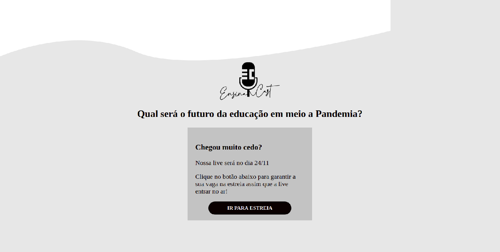

<h1 align="center">
    
</h1>

## Sobre o Projeto 💻

O EnsinaCast nasceu quando um grupo de malucos se juntam e decidem compartilhar conhecimentos sobre diversos assuntos! Começando pelo tema: "Qual será o futuro da educação em meio a Pandemia?"  

## O Começo / Diário 

Logo após a reunião de Domingo (22/11), os Hipsters enviaram a primeira versão do desing da landing page.   

Após a primeira madrugada a primeira versão da landing page estava no ar o mais rápido possível! Resultado:

<h1 align="center">
    
</h1>

Um desastre! Mas pelo menos a landing page já estava no ar!
Ao final do mesmo dia, após outra reunião foi decidido usar o RD Station...

Após a segunda madrugada na terça-feira de manhã já estava no ar a nova landing page! Então ela se tornou a nossa página oficial [EstudaCast](https://evento.ensinacast.com.br/futuro2021).

## Checklist - Hacker 🐴 
Para não abandonar o repositório, continuei trabalhando nele em paralelo entender um pouco mais. Aprendizado:
- Um pouco mais de noção em HTML, CSS e JavaScript;
- Como fazer um botão e linkar ele;
- Como fazer um Pop-up;
- Como não ativar o Pop-up o tempo todo;
- Como não fazer um Countdown;
- Aprendi a pesquisar: "[How to create a countdown timer](https://www.w3schools.com/howto/howto_js_countdown.asp)"
- Integrar pixels de rastreamento em páginas do projeto; 
- Como adicionar um Favicon!
- Um pouco do uso do Iframe;
- Responsividade ❌ 

